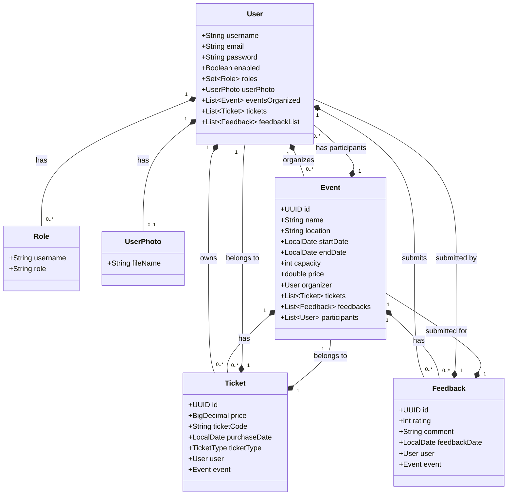

```mermaid
classDiagram
    class User {
        +String username
        +String email
        +String password
        +Boolean enabled
        +Set~Role~ roles
        +UserPhoto userPhoto
        +List~Event~ eventsOrganized
        +List~Ticket~ tickets
        +List~Feedback~ feedbackList
    }

    class Role {
        +String username
        +String role
    }

    class UserPhoto {
        +String fileName
    }

    class Ticket {
        +UUID id
        +BigDecimal price
        +String ticketCode
        +LocalDate purchaseDate
        +TicketType ticketType
        +User user
        +Event event
    }

    class Feedback {
        +UUID id
        +int rating
        +String comment
        +LocalDate feedbackDate
        +User user
        +Event event
    }

    class Event {
        +UUID id
        +String name
        +String location
        +LocalDate startDate
        +LocalDate endDate
        +int capacity
        +double price
        +User organizer
        +List~Ticket~ tickets
        +List~Feedback~ feedbacks
        +List~User~ participants
    }

    User "1" *-- "0..*" Role : has
    User "1" *-- "0..1" UserPhoto : has
    User "1" *-- "0..*" Event : organizes
    User "1" *-- "0..*" Ticket : owns
    User "1" *-- "0..*" Feedback : submits

    Ticket "1" *-- "1" User : belongs to
    Ticket "1" *-- "1" Event : belongs to

    Feedback "1" *-- "1" User : submitted by
    Feedback "1" *-- "1" Event : submitted for

    Event "1" *-- "0..*" Ticket : has
    Event "1" *-- "0..*" Feedback : has
    Event "1" *-- "0..*" User : has participants
```