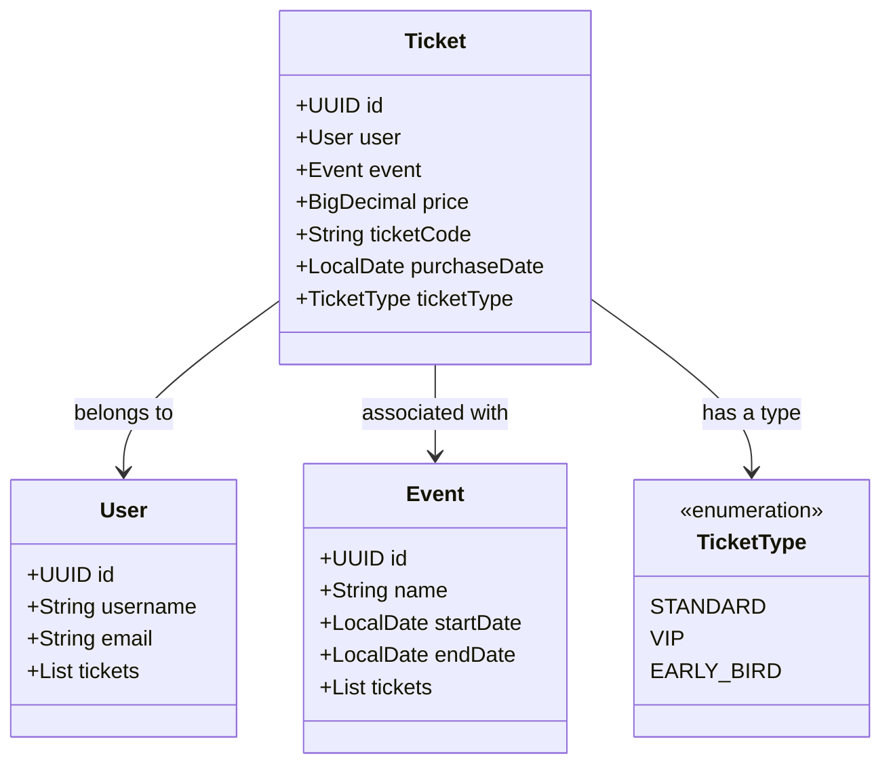

```mermaid

classDiagram
    class Ticket {
        +UUID id
        +User user
        +Event event
        +BigDecimal price
        +String ticketCode
        +LocalDate purchaseDate
        +TicketType ticketType
    }

    class User {
        +UUID id
        +String username
        +String email
        +List<Ticket> tickets
    }

    class Event {
        +UUID id
        +String name
        +LocalDate startDate
        +LocalDate endDate
        +List<Ticket> tickets
    }

    class TicketType {
        <<enumeration>>
        STANDARD
        VIP
        EARLY_BIRD
    }

    Ticket --> User : belongs to
    Ticket --> Event : associated with
    Ticket --> TicketType : has a type
```