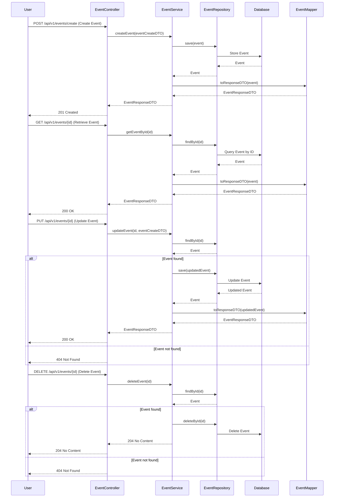

```mermaid

sequenceDiagram
    participant User
    participant EventController
    participant EventService
    participant EventRepository
    participant Database
    participant EventMapper

    User ->> EventController: POST /api/v1/events/create (Create Event)
    EventController ->> EventService: createEvent(eventCreateDTO)
    EventService ->> EventRepository: save(event)
    EventRepository ->> Database: Store Event
    Database -->> EventRepository: Event
    EventRepository -->> EventService: Event
    EventService ->> EventMapper: toResponseDTO(event)
    EventMapper -->> EventService: EventResponseDTO
    EventService -->> EventController: EventResponseDTO
    EventController -->> User: 201 Created

    User ->> EventController: GET /api/v1/events/{id} (Retrieve Event)
    EventController ->> EventService: getEventById(id)
    EventService ->> EventRepository: findById(id)
    EventRepository ->> Database: Query Event by ID
    Database -->> EventRepository: Event
    EventRepository -->> EventService: Event
    EventService ->> EventMapper: toResponseDTO(event)
    EventMapper -->> EventService: EventResponseDTO
    EventService -->> EventController: EventResponseDTO
    EventController -->> User: 200 OK

    User ->> EventController: PUT /api/v1/events/{id} (Update Event)
    EventController ->> EventService: updateEvent(id, eventCreateDTO)
    EventService ->> EventRepository: findById(id)
    EventRepository -->> EventService: Event
    alt Event found
        EventService ->> EventRepository: save(updatedEvent)
        EventRepository ->> Database: Update Event
        Database -->> EventRepository: Updated Event
        EventRepository -->> EventService: Event
        EventService ->> EventMapper: toResponseDTO(updatedEvent)
        EventMapper -->> EventService: EventResponseDTO
        EventService -->> EventController: EventResponseDTO
        EventController -->> User: 200 OK
    else Event not found
        EventController -->> User: 404 Not Found
    end

    User ->> EventController: DELETE /api/v1/events/{id} (Delete Event)
    EventController ->> EventService: deleteEvent(id)
    EventService ->> EventRepository: findById(id)
    EventRepository -->> EventService: Event
    alt Event found
        EventService ->> EventRepository: deleteById(id)
        EventRepository ->> Database: Delete Event
        EventService -->> EventController: 204 No Content
        EventController -->> User: 204 No Content
    else Event not found
        EventController -->> User: 404 Not Found
    end


```