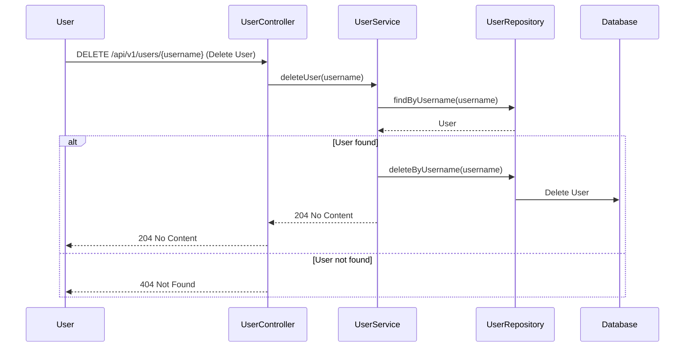

```mermaid
sequenceDiagram
    participant User
    participant UserController
    participant UserService
    participant UserRepository
    participant Database

    User ->> UserController: DELETE /api/v1/users/{username} (Delete User)
    UserController ->> UserService: deleteUser(username)
    UserService ->> UserRepository: findByUsername(username)
    UserRepository -->> UserService: User
    alt User found
        UserService ->> UserRepository: deleteByUsername(username)
        UserRepository ->> Database: Delete User
        UserService -->> UserController: 204 No Content
        UserController -->> User: 204 No Content
    else User not found
        UserController -->> User: 404 Not Found
    end
```