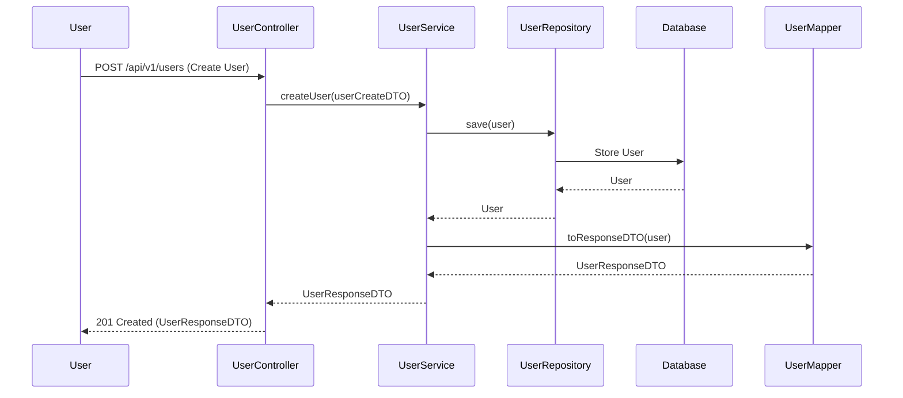

```mermaid
sequenceDiagram
    participant User
    participant UserController
    participant UserService
    participant UserRepository
    participant Database
    participant UserMapper

    User ->> UserController: POST /api/v1/users (Create User)
    UserController ->> UserService: createUser(userCreateDTO)
    UserService ->> UserRepository: save(user)
    UserRepository ->> Database: Store User
    Database -->> UserRepository: User
    UserRepository -->> UserService: User
    UserService ->> UserMapper: toResponseDTO(user)
    UserMapper -->> UserService: UserResponseDTO
    UserService -->> UserController: UserResponseDTO
    UserController -->> User: 201 Created (UserResponseDTO)

```